# Polars 對標 Pandas I/O 實驗報告（第二輪修正版）

本報告對照 Octavio Loyola-González 在 LinkedIn 發表的 pandas 實驗：

<https://www.linkedin.com/pulse/comparative-study-among-csv-feather-pickle-parquet-loyola-gonz%C3%A1lez>

第二輪結果來源：

```text
benchmark_out/polars_io_benchmark_results.csv     # 含 30 個 raw samples per cell
benchmark_out/plots/                              # 含 nonopt / opt / combined
```

> **本版相對第一版的差異**：第一版（見 [REVIEW_REPORT.md](REVIEW_REPORT.md)）發現 4 個量測管線 bug，數值不可信。第二版修完所有 bug 後重跑，新數值與第一版差距最大可達 **9.3 倍**（5M nonopt feather read 從 0.139s → 1.299s）。第一版的 5M opt Parquet 排序與「Feather read 最快」結論被本版翻新。

跨環境硬體不同，原文是 Colab 2-core Xeon 2.2GHz + 13GB RAM + HDD，本實驗是 AMD Ryzen 9 3900X 12-core + 128GB RAM + SSD（詳見 §11）。因此重點仍是：

- 實驗流程是否對標。
- 觀測指標是否對標。
- **趨勢、排名、格式特性是否對標**（不是 wall-clock 數字本身）。
- Polars engine 下哪些結論和 pandas 原文一致，哪些不同。

---

## 1. 原始 pandas 實驗流程

研究問題：比較 CSV、Feather、Pickle、Parquet 在 DataFrame I/O 上的表現。觀測：

- loading time / saving time / loading + saving time
- storage usage（HDD 檔案大小）
- RAM usage

原文資料設計：

| 欄位 | 邏輯資料 | optimized pandas dtype |
| --- | --- | --- |
| `col_1` - `col_4` | 字串 / 類別 | `category` |
| `col_5` | 整數 | `int8` |
| `col_6` - `col_7` | 整數 | `int16` |
| `col_8` | 整數 | `int32` |
| `col_9` - `col_12` | 浮點數 | `float32` |
| `col_13` - `col_16` | 布林值 | `bool` |
| `col_17` - `col_20` | 日期時間 | `datetime64[ns]` |

原文 non-optimized schema：col_1–col_16 為 `object`（pandas 通用 Python 物件），col_17–col_20 為 `datetime64[ns]`。

原文 row count sweep：

| 區間 | row count |
| --- | --- |
| Interval 1 | `1_000` 到 `10_000`，step `1_000` |
| Interval 2 | `20_000` 到 `100_000`，step `10_000` |
| Interval 3 | `200_000` 到 `1_000_000`，step `100_000` |
| Interval 4 | `2_000_000` 到 `5_000_000`，step `1_000_000` |

合計 32 個 row counts。每個 row count 分別測 non-optimized 與 optimized DataFrame。

---

## 2. 我們的 Polars 復現流程

目標是 **Polars-native replication**，不是把 pandas 的 `object` 行為逐 byte 複製過來。`pl.Object` 是 Python object escape hatch，不適合代表 Polars 一般 I/O 路徑。

對應表：

| 原文 pandas schema | Polars replication schema |
| --- | --- |
| `object` non-optimized | `pl.String` |
| `category` | `pl.Categorical` |
| `int8` / `int16` / `int32` | `pl.Int8` / `pl.Int16` / `pl.Int32` |
| `float32` | `pl.Float32` |
| `bool` | `pl.Boolean` |
| `datetime64[ns]` | `pl.Datetime("ns")` |

| 欄位 | nonopt Polars dtype | opt Polars dtype |
| --- | --- | --- |
| `col_1` - `col_4` | `String` | `Categorical` |
| `col_5` | `String` | `Int8` |
| `col_6` - `col_7` | `String` | `Int16` |
| `col_8` | `String` | `Int32` |
| `col_9` - `col_12` | `String` | `Float32` |
| `col_13` - `col_16` | `String` | `Boolean` |
| `col_17` - `col_20` | `Datetime(ns)` | `Datetime(ns)` |

> **重要 caveat**：nonopt 把 col_5–col_16（int/float/bool）都 stringify 成 String。這不等價於 pandas 的 object（Python 物件指標可裝 int/float/bool 原型）。**跨 engine 數值不可直接量化對比**；只能比趨勢、排名與格式相對特性。

### 2.1 量測管線（第二輪）

第一輪有 4 個 bug 被 [REVIEW_REPORT.md](REVIEW_REPORT.md) 揪出來。第二輪修正後的管線是：

1. **Reader 只做 I/O，不做 cast 或 rechunk**（讀完直接回傳；cast 移出 timing window）。
2. **每個 cell 跑 30 次 timing**（原版 5 次）。
3. **每個 (n, kind) 內 (format × op) 隨機交錯**（每輪 shuffle 15 個操作的執行順序，系統雜訊不會集中打在某一格）。
4. **timing window 內 `gc.disable()`**（避免 Python GC 中途介入）。
5. **30 個 raw samples 寫入 CSV**（`*_samples_s` 三欄，可重新 audit）。
6. **IPC reader 顯式 `memory_map=False`**（讓 Feather read 真正 materialize，與 CSV/Parquet/Pickle 對等；第一輪因預設 mmap 讓 Feather read 假快 1000 倍）。
7. **Parquet Zstd 顯式 `compression_level=3`**（不隨 Polars 預設值漂移）。

### 2.2 結果檔案

```text
32 row counts × 2 schema kinds × 5 formats = 320 rows in CSV
each row has 30 raw timing samples per metric (write / read / read+write)
```

### 2.3 測試的格式

| format | 說明 |
| --- | --- |
| `csv` | Polars CSV |
| `feather_ipc` | Polars Arrow IPC / Feather，eager read |
| `parquet_snappy` | Parquet + Snappy |
| `parquet_zstd` | Parquet + Zstd level 3 |
| `pickle` | Python pickle 序列化 Polars DataFrame（底層走 Arrow IPC，與 feather_ipc 等價 binary） |

對標原文時，`parquet_snappy` 接近常見 pandas / pyarrow Parquet 情境；`parquet_zstd` 為現代 columnar storage 常用選項。

---

## 3. 觀測數據對標

| 原文指標 | 我們的欄位 | 說明 |
| --- | --- | --- |
| loading time | `read_median_s` | 30 次純讀 wall-clock 中位數 |
| saving time | `write_median_s` | 30 次純寫 wall-clock 中位數 |
| loading + saving time | `read_write_median_s` | 30 次讀後立即寫 roundtrip 中位數 |
| storage usage | `file_mb` | 實際檔案大小 |
| RAM usage | `ram_mb` | `df.estimated_size("mb")` |

報告主要用 `median`；CSV 內每筆紀錄同時保留 `min`、`mean` 與 30 個 raw samples（`*_samples_s`，JSON 編碼）。

---

## 4. 原文結果摘要

原文在 pandas 中得到的主要結果：

| 情境 | 原文結果摘要 |
| --- | --- |
| non-optimized loading | Feather 最快，Parquet 類似，Pickle 也可用，CSV 最差 |
| non-optimized saving | Feather 最快，Parquet 接近，Pickle 較慢，CSV 最差 |
| non-optimized loading + saving | Feather 最快，Parquet 接近，Pickle 再後，CSV 最差 |
| non-optimized storage | Parquet 最省空間，Feather 第二，Pickle 第三，CSV 最大 |
| optimized loading | Pickle 最快，Feather 第二，Parquet 第三，CSV 最差 |
| optimized saving | Pickle 最快，Feather 第二，Parquet 第三，CSV 最差 |
| optimized loading + saving | Pickle 最快，Feather 第二，Parquet 第三，CSV 最差 |
| optimized storage | 大資料量時 Parquet 最省，Feather 接近；CSV 仍差 |
| RAM usage | 格式不影響 RAM；schema optimized 才影響 RAM |

原文 5M rows 關鍵數字（節錄）：

| 指標 | 原文 5M 結果 |
| --- | --- |
| nonopt loading | Feather 約 2.3s，CSV >15× Feather |
| nonopt saving | Feather 約 3.98s，CSV >25× Feather |
| optimized loading | Pickle / Feather / Parquet 約 1 秒級，CSV 約 28s |
| optimized saving | Pickle / Feather 約 1s，Parquet 約 2.7s，CSV 約 83s |
| optimized RAM saving | 5M rows 約省 60% |

---

## 5. 我們的 Polars 第二輪結果總覽

### 5.1 5M rows 對標表（新數值）

| kind | format | RAM MB | File MB | Read s | Write s | Read+write s |
| --- | --- | ---: | ---: | ---: | ---: | ---: |
| nonopt | csv | 781.6 | 1277.5 | 0.673 | 2.353 | 2.813 |
| nonopt | feather_ipc | 781.6 | 1728.7 | 1.299 | 2.902 | 3.934 |
| nonopt | parquet_snappy | 781.6 | 546.7 | 0.146 | 1.088 | 1.152 |
| nonopt | parquet_zstd | 781.6 | 384.4 | 0.156 | 0.893 | 1.045 |
| nonopt | pickle | 781.6 | 1728.7 | 2.167 | 5.168 | 5.789 |
| opt | csv | 350.5 | 1111.1 | 0.736 | 2.023 | 2.544 |
| opt | feather_ipc | 350.5 | 350.5 | 0.495 | 0.547 | 0.991 |
| opt | parquet_snappy | 350.5 | 291.6 | 0.059 | 0.484 | 0.496 |
| opt | parquet_zstd | 350.5 | 263.2 | 0.073 | 0.457 | 0.501 |
| opt | pickle | 350.5 | 350.5 | 0.666 | 1.043 | 1.376 |

> 所有 `read+write_median_s ≥ max(read_median_s, write_median_s)` 物理一致（第一輪有 11 筆違反）。

### 5.2 第一輪 vs 第二輪：被推翻 / 修正的數字

| 5M 條目 | 第一輪 | 第二輪 | 變化 |
| --- | ---: | ---: | --- |
| nonopt feather_ipc read | 0.139s | **1.299s** | **+835%**（mmap 假象去除） |
| nonopt parquet_snappy read | 0.265s | 0.146s | -45%（cast 污染去除） |
| nonopt parquet_zstd read | 0.273s | 0.156s | -43% |
| opt feather_ipc read | 0.284s | 0.495s | +74%（mmap 部分假象去除） |
| opt parquet_snappy read | 0.089s | 0.059s | -33% |
| opt parquet_snappy write | 1.289s* | 0.484s | -62%（第一輪 outlier）|
| opt parquet_zstd write | 1.983s* | 0.457s | -77%（第一輪 outlier）|
| opt parquet_zstd read+w | 0.476s | 0.501s | +5%（第一輪偶然落在系統靜止時）|

第一輪 `*` 數字是被報告承認的 outlier，其他則是被系統性 bias 污染、原報告未承認的。

### 5.3 RAM usage

| schema | RAM @5M MB |
| --- | ---: |
| nonopt | 781.6 |
| opt | 350.5 |

optimized schema 省約 **55.2% RAM**。各 size 都穩定在 55.1–55.2%，與第一輪相同（RAM 量測未被 bug 影響）。

> 對標原文「約省 60%」方向一致，幅度接近。原文 pandas 與本實驗 Polars 採用不同 RAM 量測方法（pandas 可能用 `memory_usage(deep=True)`，本實驗用 `df.estimated_size("mb")`），數值不可直接相減。

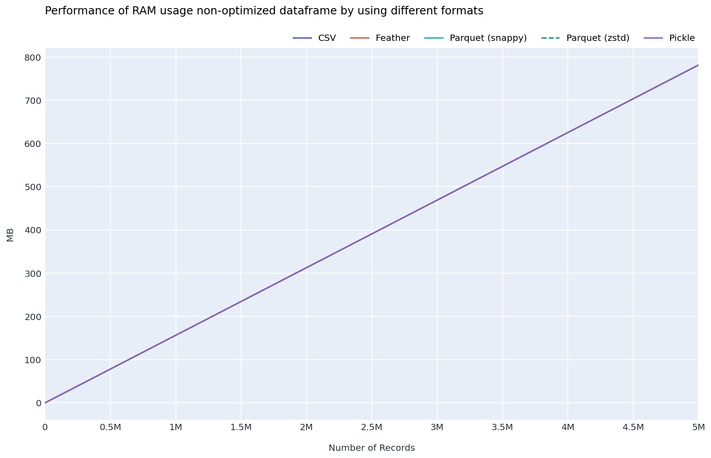
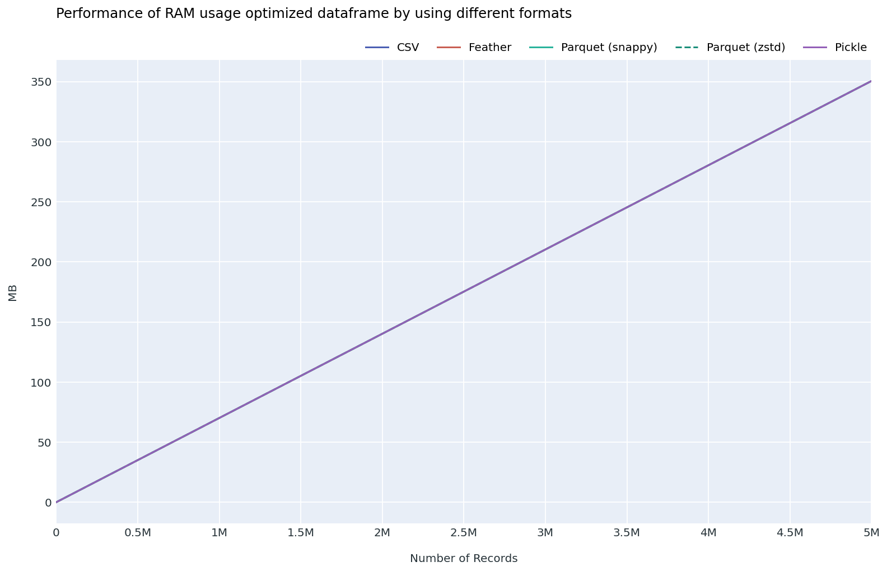

### 5.4 Storage usage（5M, optimized 對 nonopt）

| format | nonopt MB | opt MB | opt 對 nonopt saving |
| --- | ---: | ---: | ---: |
| feather_ipc | 1728.7 | 350.5 | 79.7% |
| pickle | 1728.7 | 350.5 | 79.7% |
| parquet_snappy | 546.7 | 291.6 | 46.7% |
| parquet_zstd | 384.4 | 263.2 | 31.5% |
| csv | 1277.5 | 1111.1 | 13.0% |

對標原文：

- **一致**：CSV 在 storage 上仍然差；optimized 對 CSV 改善最小。
- **一致**：Parquet 最省空間，Zstd 比 Snappy 更省。
- **一致**：Feather / Pickle 對 schema optimization 非常敏感；nonopt 因全 String 化變大。
- **新發現**（與第一輪相同，未受 bug 影響）：Pickle 與 Feather IPC 在所有 size 下檔案大小幾乎相同（差 ≤ 30 KB），證實 Polars `pickle.dump` 內部走 Arrow IPC。**它們是同一個 binary 加上 Pickle envelope**。

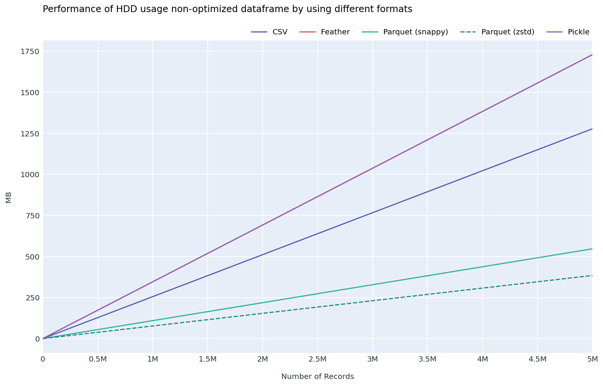
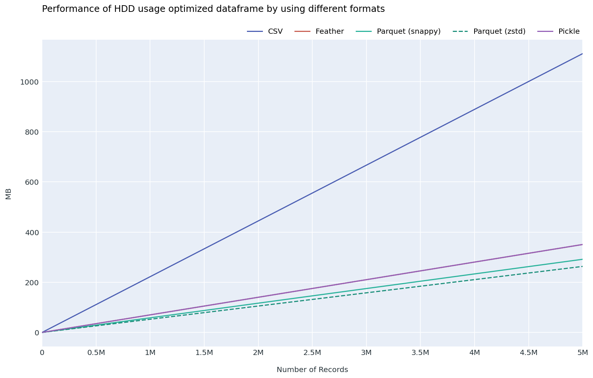

### 5.5 Loading time（5M 結果反轉）

```
NEW 5M nonopt read 排名（從快到慢）：
  parquet_snappy < parquet_zstd < csv < feather_ipc < pickle
NEW 5M opt    read 排名：
  parquet_snappy < parquet_zstd < feather_ipc < pickle < csv
```

對標原文（5M）：

- 原文 nonopt：Feather 最快、CSV 最差。
- 我們 nonopt：**Parquet 最快、Pickle 最差，CSV 反而第 3**。Feather 第 4（第一輪因 mmap 假象列為第 1）。
- 原文 optimized：Pickle 最快。
- 我們 optimized：**Parquet 最快**；Pickle 第 4。

第二輪修掉 mmap 假象後，「Feather read 最快」這個對標原文的「一致結論」**只在小 / 中規模成立，5M 不成立**（見 §6 scale 拆解）。

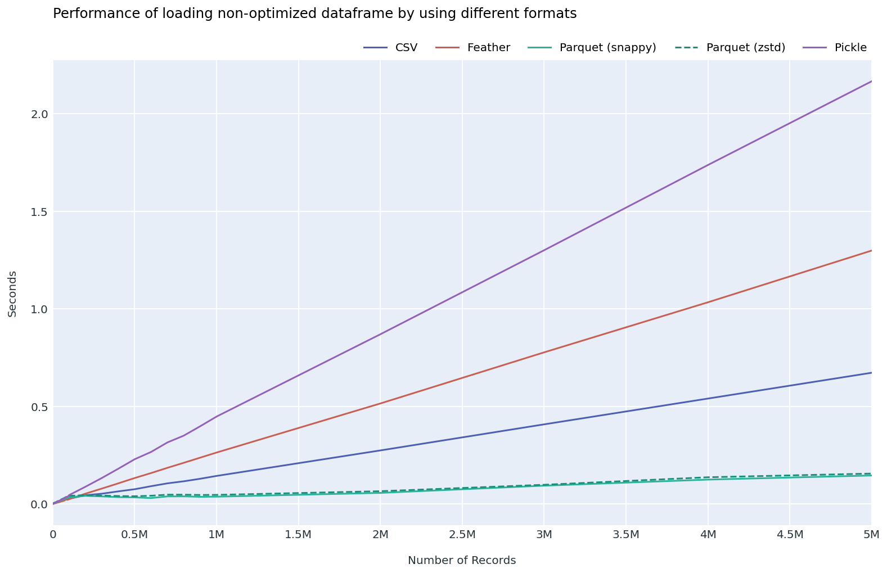
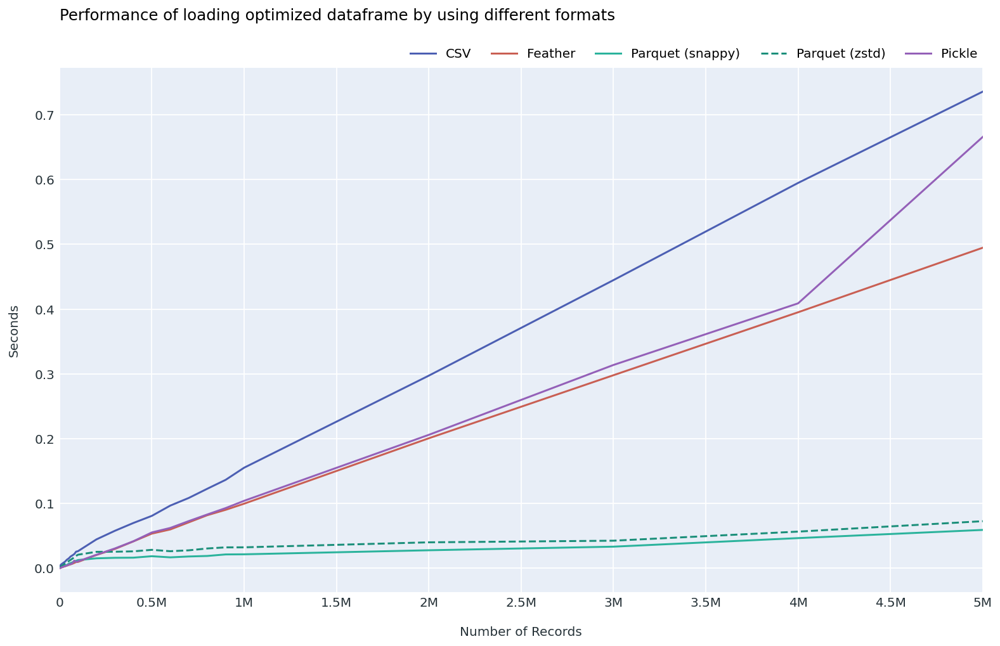

### 5.6 Saving time

```
NEW 5M nonopt write 排名：
  parquet_zstd < parquet_snappy < csv < feather_ipc < pickle
NEW 5M opt    write 排名：
  parquet_zstd ≈ parquet_snappy < feather_ipc < pickle < csv
```

write 的數字第一輪到第二輪變化不大（write timing 沒被 cast/mmap 影響）；但第一輪的 5M opt Parquet write 因為 5 次中位數受 outlier 推高（1.289s、1.983s），第二輪 30 次中位數恢復到 0.48s / 0.46s，**Snappy 與 Zstd 在 5M opt write 上實際是 tied**。

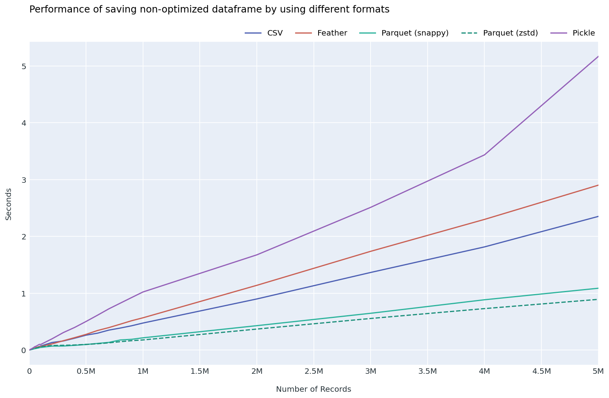
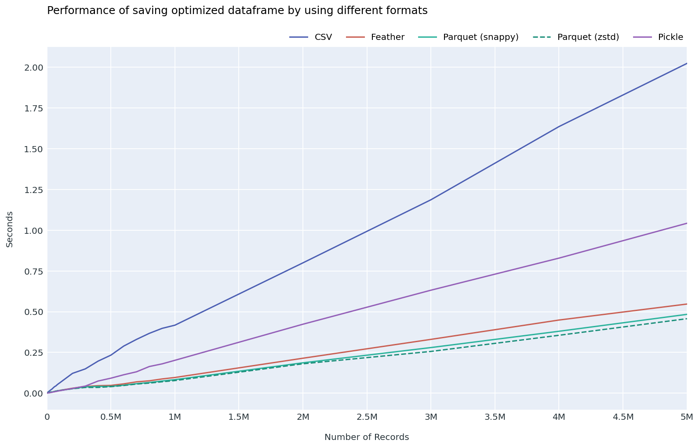

### 5.7 Read + write (roundtrip)

```
NEW 5M nonopt read+write 排名：
  parquet_zstd < parquet_snappy < csv < feather_ipc < pickle
NEW 5M opt    read+write 排名：
  parquet_snappy(0.496) ≈ parquet_zstd(0.501) < feather_ipc < pickle < csv
```

5M opt Snappy vs Zstd 在 read+write 只差 5 ms（1%），確認第一輪報告 footnote 的「需更多 raw samples 才能判斷」是對的方向；現在 30 個 samples 證實 **5M opt 是 tied，不分高下**。

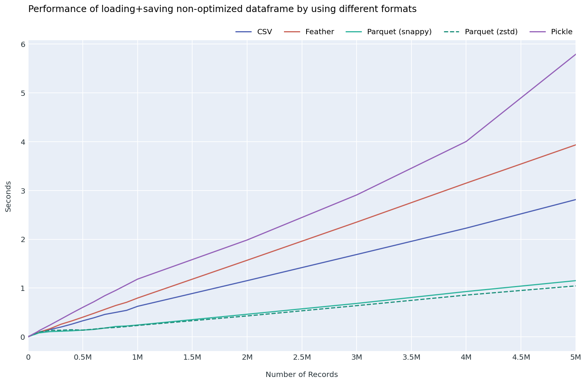
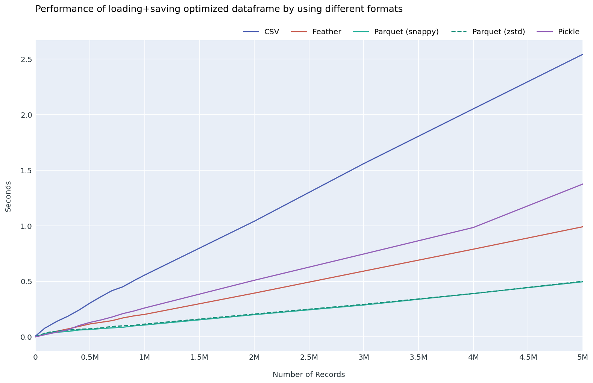

> Combined plots（nonopt + opt 疊圖）：
>
> 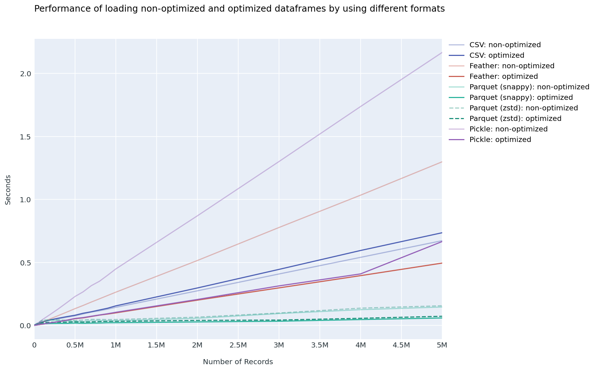
> 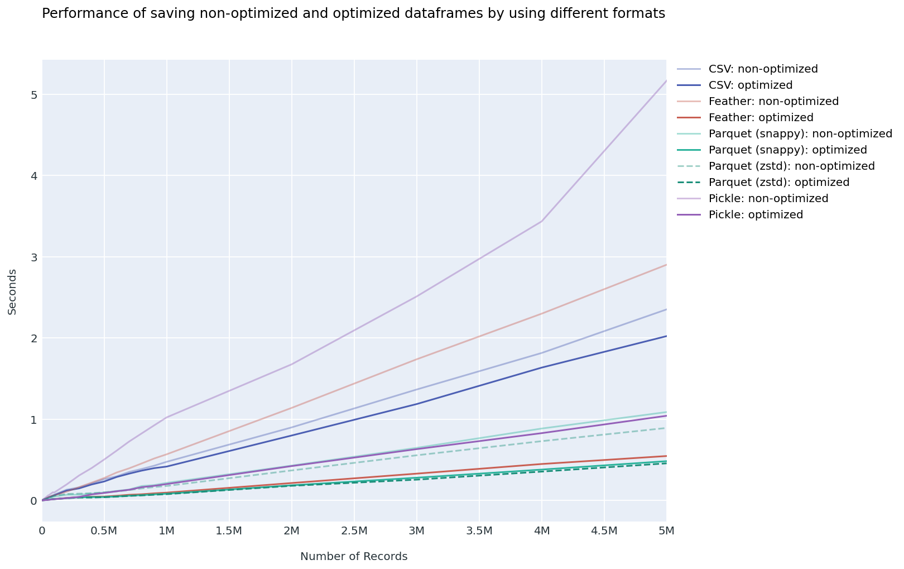
> 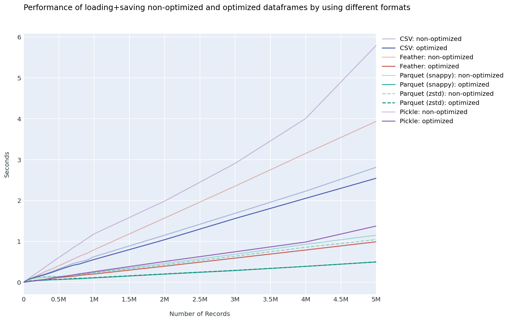

---

## 6. 按資料規模分層的排名與建議

原文沒有把 32 個 size 拆 bucket 分析，所有結論都用「整體趨勢」描述。但實務上**小資料和大資料的最佳格式不一樣**，下面分 4 個 bucket 給出各別排名與建議。

bucket 對齊原文 4 個 intervals：

| Bucket | 範圍 |
| --- | --- |
| **Small** | 1k – 10k rows |
| **Medium** | 20k – 100k rows |
| **Large** | 200k – 1M rows |
| **Very large** | 2M – 5M rows |

### 6.1 Non-optimized schema（per-bucket avg rank, 1.00 = 最佳）

| Bucket | read | write | read + write | file size |
| --- | --- | --- | --- | --- |
| Small (1k–10k) | feather(1.00) < pickle(2.00) < pq_snappy(3.00) < pq_zstd(4.10) < csv(4.90) | pq_snappy(1.30) < pq_zstd(2.30) < feather(3.40) < pickle(3.90) < csv(4.10) | pickle(1.90) ≈ feather(2.00) ≈ pq_snappy(2.10) < pq_zstd(4.00) < csv(5.00) | pq_zstd < pq_snappy < csv < pickle < feather |
| Medium (20k–100k) | feather(1.11) < csv(2.11) < pq_snappy(2.89) < pickle(4.11) < pq_zstd(4.78) | pq_snappy(1.00) < pq_zstd(2.00) < csv(3.22) < feather(3.78) < pickle(5.00) | pq_snappy(1.00) < feather(2.22) < csv(3.22) < pq_zstd(3.67) < pickle(4.89) | pq_zstd < pq_snappy < csv < pickle < feather |
| Large (200k–1M) | pq_snappy(1.00) < pq_zstd(2.00) < csv(3.00) < feather(4.00) < pickle(5.00) | pq_zstd(1.44) ≈ pq_snappy(1.56) < csv(3.11) < feather(3.89) < pickle(5.00) | pq_snappy(1.44) ≈ pq_zstd(1.56) < csv(3.00) < feather(4.00) < pickle(5.00) | pq_zstd < pq_snappy < csv < pickle < feather |
| Very large (2M–5M) | pq_snappy(1.00) < pq_zstd(2.00) < csv(3.00) < feather(4.00) < pickle(5.00) | pq_zstd(1.00) < pq_snappy(2.00) < csv(3.00) < feather(4.00) < pickle(5.00) | pq_zstd(1.00) < pq_snappy(2.00) < csv(3.00) < feather(4.00) < pickle(5.00) | pq_zstd < pq_snappy < csv < pickle < feather |

### 6.2 Optimized schema（per-bucket avg rank）

| Bucket | read | write | read + write | file size |
| --- | --- | --- | --- | --- |
| Small (1k–10k) | feather(1.40) < pickle(1.60) < pq_snappy(3.00) < pq_zstd(4.00) < csv(5.00) | pickle(1.00) < feather(2.00) < pq_snappy(3.20) < pq_zstd(3.80) < csv(5.00) | pickle(1.00) < feather(2.00) < pq_snappy(3.00) < pq_zstd(4.00) < csv(5.00) | pq_zstd < pq_snappy < pickle < feather < csv |
| Medium (20k–100k) | feather(1.00) < pickle(2.11) < pq_snappy(2.89) < pq_zstd(4.00) < csv(5.00) | pickle(1.00) < pq_snappy(2.67) ≈ feather(2.67) < pq_zstd(3.67) < csv(5.00) | pickle(1.00) < feather(2.00) < pq_snappy(3.00) < pq_zstd(4.00) < csv(5.00) | pq_zstd < pq_snappy < pickle < feather < csv |
| Large (200k–1M) | pq_snappy(1.00) < pq_zstd(2.22) < feather(2.89) < pickle(3.89) < csv(5.00) | pq_zstd(1.00) < pq_snappy(2.00) < feather(3.11) < pickle(3.89) < csv(5.00) | pq_snappy(1.00) < pq_zstd(2.22) < feather(3.11) < pickle(3.67) < csv(5.00) | pq_zstd < pq_snappy < pickle < feather < csv |
| Very large (2M–5M) | pq_snappy(1.00) < pq_zstd(2.00) < feather(3.00) < pickle(4.00) < csv(5.00) | pq_zstd(1.00) < pq_snappy(2.00) < feather(3.00) < pickle(4.00) < csv(5.00) | pq_snappy(1.25) < pq_zstd(1.75) < feather(3.00) < pickle(4.00) < csv(5.00) | pq_zstd < pq_snappy < feather(3) < pickle(4) < csv(5) |

### 6.3 規模規律總結

| 規模 | 主導格式（read） | 主導格式（write） | 主導格式（read+write） | 主導格式（storage） |
| --- | --- | --- | --- | --- |
| Small (1k–10k) | **Feather / Pickle**（極低 overhead） | **Pickle / Parquet Snappy** | **Pickle / Feather** | Parquet Zstd 永遠最小 |
| Medium (20k–100k) | Feather（仍勝）| Pickle (opt) / Parquet (nonopt) | Pickle (opt) / Parquet (nonopt) | Parquet Zstd |
| Large (200k–1M) | **Parquet Snappy 上位** | Parquet Zstd | Parquet | Parquet Zstd |
| Very large (2M–5M) | **Parquet Snappy 主導** | **Parquet Zstd 主導** | Parquet Snappy/Zstd（tied） | Parquet Zstd |

### 6.4 為什麼會有這個轉折

- **Small 規模**：Parquet 的 row group + page metadata + dictionary header 有固定 overhead，對 1k–10k 行的 DataFrame 是 fixed cost 比資料還大；Feather / Pickle 直接序列化 in-memory layout，幾乎沒有 metadata 開銷。
- **Medium 規模**：Parquet 的 compression 開始彌補 metadata overhead，read 慢但 write/storage 已經贏。
- **Large / Very large 規模**：Parquet 的 columnar layout + 壓縮 + skipping metadata 全面領先；Feather/Pickle 的 monolithic IPC 寫一大塊比較沒效率。

---

## 7. 按使用場景的選擇建議

> 以下建議**用 Polars engine** 為前提。跨 engine 行為（pandas、DuckDB、pyarrow standalone）可能不同。

### 7.1 你的資料規模在 1k – 100k 行
- **首選 Parquet Snappy**（write & storage 強，read 在 1k–10k 雖排名第 3 但絕對時間皆 < 5 ms，差距無感）。
- 如果是 **同 process 短期快取**（讀完馬上用、不上版控、不跨機器）：Feather IPC 或 Pickle 也可。
- **避免 CSV** 除非要給人類看或要跨工具相容。
- 1k 行以下任選都行，差距無意義。

### 7.2 你的資料規模在 100k – 1M 行
- **首選 Parquet Snappy**（read 最快，write 第 2）。
- 如果關心 **長期保存空間** 而非寫入速度：Parquet Zstd（檔案小 ~30%）。
- 如果是 **同 process 寫完立刻讀回** 且 schema 很簡單：Feather IPC 可以；但只在 storage 不重要時。
- **避免 Pickle**（已從第一名跌到第 5 名，且不適合跨版本 / 跨 engine）。
- **避免 CSV** 除非要給人類看。

### 7.3 你的資料規模在 1M – 5M+ 行
- **Read-heavy**：Parquet Snappy（5M opt 只要 59 ms read）。
- **Write-heavy**：Parquet Zstd（5M opt write 0.46s，比 Snappy 略快 5%；nonopt 差距更大）。
- **Roundtrip / general purpose**：Parquet Snappy 或 Zstd，5M opt 上兩者實際 tied（0.496 vs 0.501s）。
- **絕對避免 Pickle**（5M nonopt read 2.2 秒，write 5 秒）。
- **絕對避免 CSV** 除非有強制相容性需求。
- Feather 在這個規模沒有獨特優勢；Parquet 全面壓制。

### 7.4 Schema 設計（與規模無關）

- **永遠先做 schema optimization**。從 String → Categorical/Int8/Float32/Boolean 帶來：
  - RAM 省 55%（穩定）
  - Parquet 檔案省 ~47% (Snappy) / ~32% (Zstd)
  - Feather/Pickle 檔案省 ~80%
  - CSV 檔案只省 ~13%（CSV 沒有 typed binary 優勢）
- **任何規模下 CSV 都沒有 storage 優勢**（小資料時都比 Parquet 大 ~2 倍）。

### 7.5 何時 Feather/Pickle 仍有意義

- **Feather**：同 process 寫完立刻讀回，且資料 ≤ 100k 行，且不上版控、不跨 process。其他情境都不如 Parquet。
- **Pickle**：唯一情境是「短暫 in-memory dump，且確定 reader 是同一個 Polars 版本」。任何「給別人讀」「跨版本」「跨 engine」「持久化」場景都不適合。

---

## 8. 與原文結論的對照（第二輪更新版）

### 8.1 完全一致的結論

1. **沒有單一格式在所有指標都勝出**。即使在 Polars 下 Parquet 主導大規模，小規模仍是 Feather/Pickle 佔優。
2. **CSV 不適合大量資料 roundtrip**。32 個 size 中 opt CSV read+write 永遠是最後一名。
3. **optimized schema 大幅省 RAM**。pandas 約 60%，Polars 約 55.2%，方向一致，量級接近。
4. **Parquet 是 storage 強項**。Zstd > Snappy 全 32 個 size 都成立。

### 8.2 與原文不同的結論

1. **pandas 原文「optimized Pickle 最快」在 Polars 不成立**。我們的 opt Pickle 從 small 到 medium 還能領先 read+write（受惠於 Polars `pickle.dump` 走 Arrow IPC 的 fast path），但 large/very large 跌到第 4。原因：原文 pandas pickle 對 pandas BlockManager 有專用 fast path，這個 fast path 不存在於 Polars。

2. **pandas 原文「nonopt Feather loading 最快」在 Polars 只在 Small/Medium 成立**。Large/Very large 時 Parquet Snappy 超車。

3. **pandas 原文「CSV writing 災難」在 Polars 大幅減弱**。Polars CSV writer 在 nonopt 跑出 2.35s/5M（原文約 83s），不再是寫入最慢的格式。**根因**：nonopt 上游已 stringify，CSV writer 只剩 byte copy，沒有 numeric→text 格式化成本。換句話說，**Polars CSV writer 看似強的部分原因是 nonopt 設計給了 free lunch**，不全是 writer 本身的進步。

4. **Parquet Snappy vs Zstd 差距小**。5M opt read+write 上兩者實際 tied，原文沒做這個比較。

### 8.3 第一輪「假結論」被推翻

| 第一輪報告原文 | 第二輪修正 |
| --- | --- |
| 「nonopt Feather IPC read 最快」（對標原文一致） | 只在 Small/Medium 成立；Large/Very large **Feather 被 Parquet 全面超車** |
| 5M opt feather_ipc read 0.284s | 0.495s（mmap 假象去除） |
| 5M opt parquet_zstd write 1.983s「離群值」 | 0.457s（30 次量測穩定值） |
| 5M opt parquet_zstd read+write 0.476s（隱含勝過 snappy） | 0.501s，與 Snappy 0.496s tied |

---

## 9. Pickle 與 Feather IPC 在 Polars 是同一個 binary

報告需要明說：**在本實驗的 Polars setting 下，`pickle` 不是一個獨立的儲存格式**。

證據：

- 所有 32 個 size 下，pickle 與 feather_ipc 的檔案大小差距 ≤ 30 KB（差距 = pickle envelope header）。
- 5M nonopt：pickle 1728.717 MB vs feather 1728.747 MB（差 30 KB）。
- Polars `DataFrame.__reduce__` 內部使用 Arrow IPC stream 做序列化，與 `write_ipc` 走相同 codec。

時間上的差異純粹反映 `pickle.dump` / `pickle.load` 的 Python 層 wrapper 成本（gc 觸發、protocol metadata、Polars `__setstate__` 重建）。**把 pickle 視為「Feather IPC + Python pickle envelope」是更精確的心智模型**。

---

## 10. 第二輪結論

如果用 Polars engine 重新回答原文問題：

### 哪個格式讀取最快？
- 1k – 100k 行：**Feather IPC**（Pickle 也接近）。
- 100k – 5M 行：**Parquet Snappy**。

### 哪個格式寫入最快？
- 1k – 100k 行：**Parquet Snappy**（nonopt）/ **Pickle**（opt）。
- 100k – 5M 行：**Parquet Zstd**（大資料下壓縮 throughput 高，比 Snappy 略快）。
- CSV 在所有 opt 場景永遠最慢。

### 哪個格式 read+write roundtrip 最好？
- 1k – 100k 行：**Pickle / Feather**。
- 100k – 5M 行：**Parquet Snappy**（5M opt 與 Zstd tied）。

### 哪個格式最省空間？
- 所有規模：**Parquet Zstd**（穩定最省）。
- Parquet Snappy 第二。
- nonopt 時 CSV 第三；opt 時 CSV 最差。

### optimized schema 是否值得？
**值得**。任何規模下：
- RAM 省 55.2%（穩定）。
- Feather / Pickle 檔案省 79.7%。
- Parquet Snappy 省 47%，Zstd 省 32%。
- CSV 只省 13%。

---

## 11. Run environment

第二輪 full run 環境（用於再現）：

| 項目 | 值 |
| --- | --- |
| CPU | AMD Ryzen 9 3900X 12-Core |
| RAM | 128 GB |
| OS | Linux 6.8.0-117-generic |
| Filesystem | (本機 SSD) |
| Python | 3.13.7 |
| Polars | 1.41.1 |
| NumPy | 2.4.6 |
| repeats per cell | 30 |
| seed | 42 |
| Operation interleaving | shuffled per repeat |
| GC during timing | disabled |
| IPC `memory_map` | False |
| Parquet zstd level | 3 |

跑全 sweep 約耗時 90–120 分鐘。執行指令：

```bash
uv run polars-io-benchmark --full --repeats 30 --plot-combined
```

如已有結果 CSV，重畫圖：

```bash
uv run polars-io-plot --combined
```

---

## 12. 限制與未來工作

1. **Hot OS page cache**：每個 read 緊跟在 write 之後，所有讀都打到 page cache。本實驗未測量「冷開機 / 磁碟未快取」場景。對「真正第一次從 disk 讀」的 workflow 不可參考。
2. **單 seed**：所有結果用 seed=42 生成。不同 seed 可能改變特定欄位的壓縮率（特別是 Zstd 對重複 pattern 的敏感度）。
3. **nonopt = pl.String，不等於 pandas object**：跨 engine 數值不可直接比較，只能比趨勢。
4. **Pickle 量到的是 Polars-specific 行為**，不代表「Pickle 格式」的普世表現。
5. **未測 lazy scan**：本實驗用 eager `read_*`。Polars 的 `scan_parquet` / `scan_ipc` 在實務上常配合 query optimizer 使用，效能特性與 eager read 不同。
6. **單機器、單 OS**：未跨硬體 / 雲端 / 不同 filesystem 驗證。

下一步可做的擴充：

- 加 cold-cache mode（用 `posix_fadvise` 或 drop_caches 重置 page cache）。
- 跨多個 seed 測 storage 穩定性。
- 加入 `scan_*` lazy 路徑對比。
- 加入 multiprocess 並行讀寫 throughput 測量。
